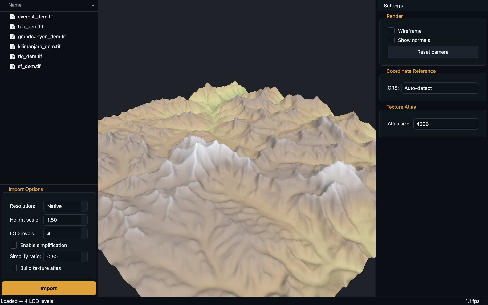

# Geospatial Terrain Importer

[](https://github.com/Luis-avalos1/geospatial-terrain-importer/actions/workflows/ci.yml)
[](https://luis-avalos1.github.io/geospatial-terrain-importer/)
[](LICENSE)


A desktop application and companion Python toolchain for turning real-world
elevation data (GeoTIFF / DEM rasters) into interactive, level-of-detail 3D
terrain. Load a digital elevation model, optionally drape a satellite image
over it, and fly around the result in an OpenGL viewport.



> **Status:** core algorithms are unit-tested and CI-verified; the C++/Qt +
> OpenGL 4.1 desktop app builds, runs, and renders (on macOS as
> `terrain-importer.app`). See the [roadmap](#roadmap) for what's next.

---

## Web showcase

A browser **showcase** (Three.js / WebGL) of what the project produces:

### **[luis-avalos1.github.io/geospatial-terrain-importer](https://luis-avalos1.github.io/geospatial-terrain-importer/)**

Orbit the camera, switch between **Mount Fuji**, **San Francisco**, **Grand
Canyon** and **Mount Everest**, toggle hillshade / elevation-colormap /
wireframe surfaces, step through the level-of-detail meshes, adjust the sun and
vertical exaggeration, and upload your own GeoTIFF DEM. The terrain is real
SRTM/NED elevation (public AWS Terrain Tiles) resampled into LOD heightfields by
this project's pipeline and draped with a generated texture.

> It's a **showcase, not the engine itself**: the built-in terrains are real
> output of the project's pipeline, but the in-browser rendering (mesh build,
> LOD, hillshade, GeoTIFF upload) is a WebGL/JS reimplementation of the same
> techniques. The actual C++/Qt/OpenGL application — the real engine — is the
> desktop app below.

---

## Features

- **GDAL-backed ingest** — reads any GDAL-supported raster (GeoTIFF, IMG, …),
  with on-the-fly bilinear resampling and nodata/NaN sanitisation.
- **Grid mesh generation** — builds a triangulated height-field with per-vertex
  normals and texture coordinates.
- **QEM mesh simplification** — Quadric Error Metric edge collapse
  (Garland & Heckbert 1997) with proper boundary-edge preservation.
- **Level-of-detail pyramid** — multiple resolutions with distance-based LOD
  selection for smooth large-terrain rendering.
- **Texture atlas packing** — shelf-packs satellite/ortho tiles into a single
  GPU texture with a UV sidecar.
- **Coordinate transforms** — thin OGR/PROJ wrapper with WGS-84 → UTM helpers.
- **Interactive renderer** — orbit camera, height colormap, wireframe / normal
  debug views, and a live FPS counter.
- **Python pipeline** — headless batch conversion, LOD generation, and atlas
  packing for server-side or scripted workflows.

## Architecture

The codebase is split so the heavy GUI/OpenGL stack is *optional*: the numeric
core is a standalone library (`terrain_core`) that depends only on GDAL, which
is what makes it testable headlessly and in CI.

```
                        ┌──────────────────────────────────────────┐
                        │             terrain-importer (app)         │
                        │                Qt Widgets GUI              │
                        │  MainWindow · FileBrowser · ImportControls │
                        └───────────────┬────────────────────────────┘
                                        │
                  ┌─────────────────────┴───────────────────────┐
                  │            renderer (Qt + OpenGL 4.1)         │
                  │  TerrainRenderer · Camera · ShaderProgram     │
                  │  GpuMesh · GLSL height-colormap shaders       │
                  └─────────────────────┬───────────────────────┘
                                        │  depends on
                  ┌─────────────────────┴───────────────────────┐
                  │      terrain_core   (GDAL only — no Qt/GL)    │
                  │                                               │
                  │  GeoTiffReader      SatelliteImageLoader      │
                  │  TerrainMesh        MeshSimplifier (QEM)      │
                  │  LodManager         TextureAtlas              │
                  │  CoordConverter (OGR/PROJ)                    │
                  └───────────────────────────────────────────────┘

   scripts/  ── a parallel Python implementation of the same pipeline
                (terrain_utils, lod_generator, batch_processor, texture_atlas)
```

### Project layout

| Path | Contents |
|------|----------|
| `src/core/`     | `terrain_core` — readers, mesh builder, simplifier, LOD, atlas, CRS |
| `src/renderer/` | OpenGL renderer + orbit camera + shader/program wrappers |
| `src/gui/`      | Qt Widgets desktop UI |
| `src/shaders/`  | GLSL vertex/fragment shaders (compiled into the binary as a Qt resource) |
| `scripts/`      | Headless Python pipeline + a synthetic-DEM generator |
| `tests/cpp/`    | C++ unit tests (dependency-free micro framework) |
| `tests/python/` | pytest suite for the Python pipeline |

## Building

### Dependencies

| Dependency | Used by | macOS (Homebrew) | Ubuntu/Debian |
|------------|---------|------------------|---------------|
| CMake ≥ 3.22 | everything | `brew install cmake` | `apt install cmake` |
| GDAL | core + scripts | `brew install gdal` | `apt install libgdal-dev` |
| GLM (header-only) | renderer + camera tests | `brew install glm` | `apt install libglm-dev` |
| Qt 6 (or 5) | GUI only | `brew install qt` | `apt install qt6-base-dev qt6-base-private-dev libqt6opengl6-dev` |
| OpenGL | GUI only | (system) | `apt install libgl1-mesa-dev` |

### Configure & build

```bash
# macOS (Homebrew): Qt is keg-only, so point CMake at the Homebrew prefixes.
cmake -B build -DCMAKE_BUILD_TYPE=Release -DBUILD_GUI=ON \
  -DCMAKE_PREFIX_PATH="$(brew --prefix qt);$(brew --prefix gdal);$(brew --prefix glm)"
cmake --build build -j

# Linux: the system packages are on the default CMake search path.
cmake -B build -DCMAKE_BUILD_TYPE=Release -DBUILD_GUI=ON
cmake --build build -j

# Headless build — just the core library and tests (no Qt/OpenGL needed)
cmake -B build -DBUILD_GUI=OFF -DBUILD_TESTING=ON
cmake --build build -j
```

On macOS this produces a double-clickable bundle, `build/terrain-importer.app`;
on Linux it produces the binary `build/terrain-importer`. The app targets
OpenGL 4.1 Core (the macOS ceiling).

## Usage

### Desktop app

```bash
open build/terrain-importer.app   # macOS
./build/terrain-importer          # Linux
```

Open a raster from **File → Open GeoTIFF…** (or select one in the file browser
and click **Import**). Use the import controls to set output resolution, height
scale, number of LOD levels, simplification, and whether to build a texture
atlas. Drag with the left mouse button to orbit, right button to pan, and scroll
to zoom.

No data handy? Generate a synthetic one (requires GDAL + numpy):

```bash
python scripts/make_sample_dem.py --output sample_dem.tif --size 512
```

### Python pipeline (headless)

```bash
# Inspect / batch-convert a directory of rasters to the TMSH binary format
python scripts/batch_processor.py --input-dir ./tiles --output-dir ./out --resolution 512 --jobs 4

# Build a LOD pyramid from one DEM
python scripts/lod_generator.py --input dem.tif --output-dir ./lods --levels 4

# Pack a folder of image tiles into a texture atlas
python scripts/texture_atlas.py --input-dir ./tiles --output atlas.png --size 4096
```

## Testing

```bash
# C++ unit tests
cmake -B build -DBUILD_GUI=OFF -DBUILD_TESTING=ON
cmake --build build -j
ctest --test-dir build --output-on-failure
# …or run the binary directly (optionally filter by suite tag):
./build/tests/cpp/terrain_tests "[simplifier]"

# Python tests
pip install -r scripts/requirements-dev.txt
pytest
```

The C++ tests use a small, vendored, dependency-free framework
(`tests/cpp/test_framework.hpp`) so the suite builds offline and adds nothing to
the project's dependency surface. Python tests use `pytest.importorskip` so the
pure-logic tests run even without GDAL/numpy installed.

## The TMSH mesh format

The Python pipeline serialises height grids to a tiny little-endian binary
container so meshes can be streamed without re-decoding rasters:

```
offset  type        field
0       char[4]     magic   = "TMSH"
4       uint32      version = 1
8       uint32      width
12      uint32      height
16      uint32      count   = width * height
20      float32[]   heights (row-major, count elements)
```

## Roadmap

- [ ] Multi-tile streaming for terrains larger than VRAM
- [ ] Geometry-clipmap renderer for continuous LOD
- [ ] Direct TMSH/atlas loading in the C++ app (today the GUI imports rasters directly)
- [ ] Headless screenshot/export mode

## License

[MIT](LICENSE) © 2026 Luis Avalos
